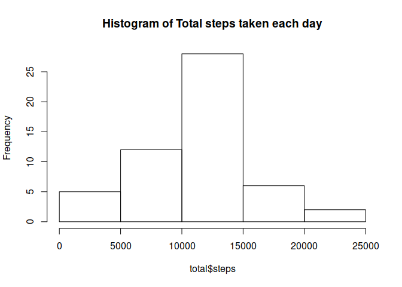
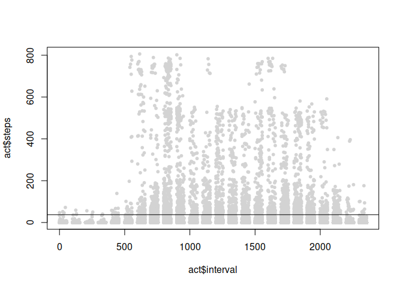
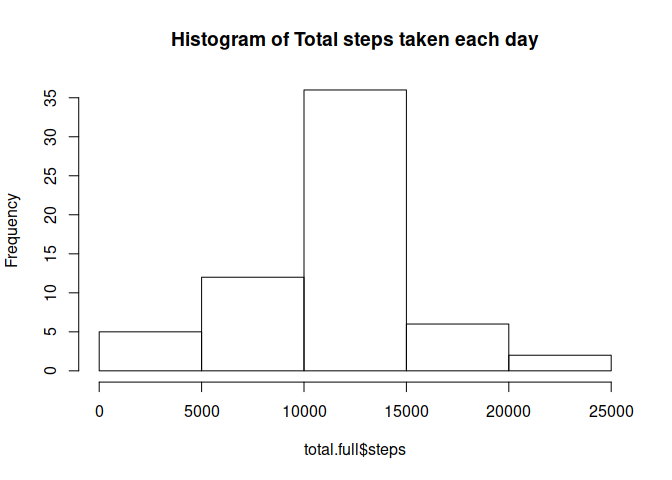
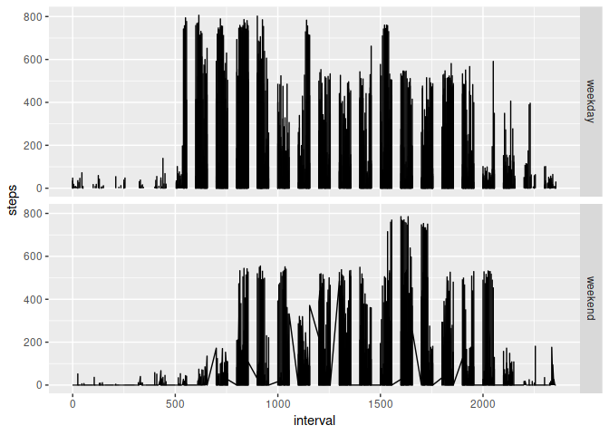

## Loading and preprocessing the data

1. Load the data

```r
act <- read.csv(unzip('activity.zip', 'activity.csv'))
```

## What is mean total number of steps taken per day?
1. Histogram of the total number of steps taken each day

```r
total <- aggregate(steps ~ date, act, sum)
hist(total$steps, main='Histogram of Total steps taken each day')
```

<!-- -->

2. Calculate and report mean and median total number of steps taken per day

```r
mean(total$steps)
```

```
## [1] 10766.19
```

```r
median(total$steps)
```

```
## [1] 10765
```

## What is the average daily activity pattern?
1. Make a time series plot of the 5-minute interval (x-axis) and the average number of steps taken, averaged across all days (y-axis)

```r
plot(act$interval, act$steps,pch=20,col="lightgray")
abline(h=mean(act$steps,na.rm=TRUE), col="black")
```

<!-- -->

2. The 5-minute interval that contains the maximum number of steps is

```r
max.step <- max(act$steps, na.rm=TRUE)
act.narm <- act[complete.cases(act$steps),]
act.narm[act.narm$steps==max.step,]$interval
```

```
## [1] 615
```
## Imputing missing values
1. The total number of missing values in the dataset is

```r
sum(!complete.cases(act))
```

```
## [1] 2304
```
2. Filling in all the missing values in the dataset.
* The missing number in the ``steps`` column

```r
sum(is.na(act$steps))
```

```
## [1] 2304
```
* Since the number of NA in ``steps`` column is equal to the number of missing values, we only need to filling in the missing values in the ``steps`` column.

3. Create a new data set with missing steps filling in with mean of 5-minute interval.

```r
mean.step = mean(act$steps,na.rm=TRUE)
full <- act %>%
          mutate( steps = ifelse(is.na(steps), mean.step, steps) )
# head(full)
# sum(!complete.cases(full))
# plot(full$interval, full$steps,pch=20,col="lightgray")
# abline(h=mean(full$steps,na.rm=TRUE), col="black")
```

4. Histogram of the total number of steps taken each day

```r
total.full <- aggregate(steps ~ date, full, sum)
hist(total.full$steps, main='Histogram of Total steps taken each day')
```

<!-- -->

* Calculate and report mean and median total number of steps taken per day

```r
mean(total.full$steps)
```

```
## [1] 10766.19
```

```r
median(total.full$steps)
```

```
## [1] 10766.19
```

* The mean is the same.
* The median is different.

The imputing missing data does not have any impact on the mean but have very slightly effect on the median.

## Are there differences in activity patterns between weekdays and weekends?

1. Create a new factor ``daytype`` with two levels ``weekday`` and ``weekend``

```r
act <- act %>%
  mutate( daytype = ifelse( 
      weekdays(as.Date(date),TRUE) %in% c("Sat","Sun"),
      'weekend',
      'weekday'
    )
  )
```
2. Plot weekday vs weekend.

```r
ggplot(act, aes(interval, steps)) +
  geom_line() + facet_grid(rows=vars(daytype))
```

```
## Warning: Removed 1 rows containing missing values (geom_path).
```

<!-- -->
